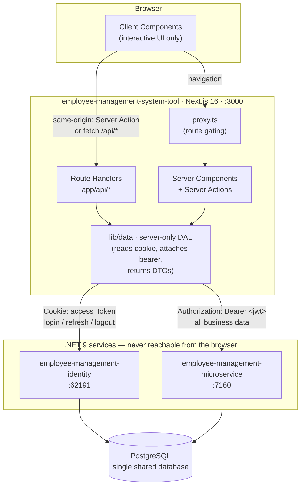
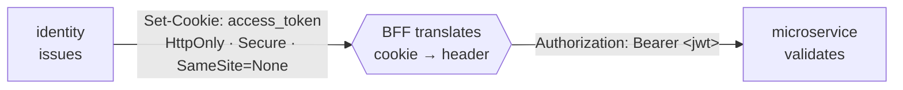
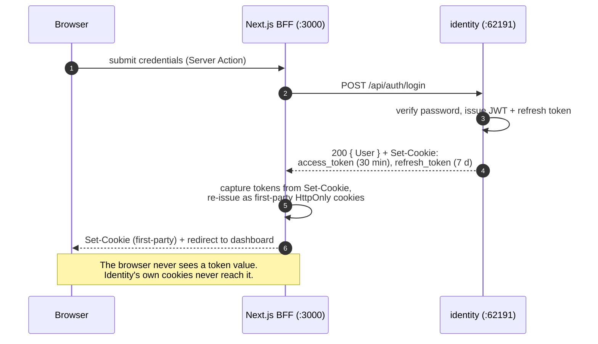
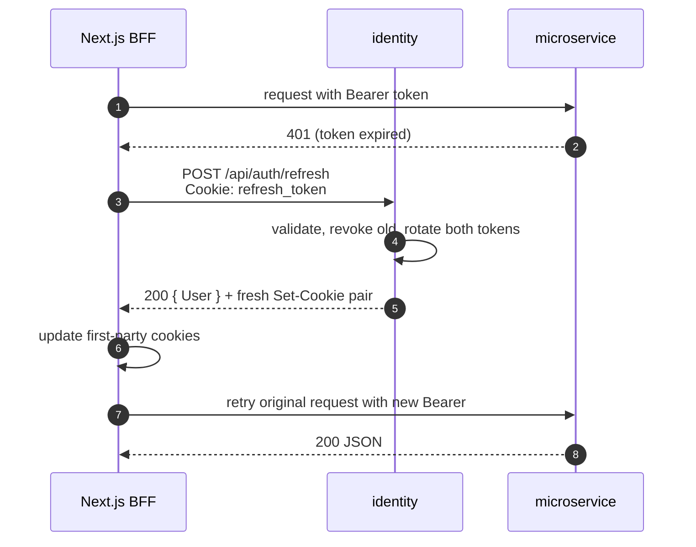

# Employee Management System Tool

The web frontend and **backend-for-frontend (BFF)** for the Employee Management platform — a
multi-tenant tool for managing an organization's internal structure: tenants, organizations,
departments, managers, employees, and reporting lines.

This repo owns **no business data and no database**. It renders the UI and acts as the only
component a browser talks to, brokering every call to two .NET 9 services behind it.

> ### Status — every part of this platform is still in flight
>
> - **This app:** freshly scaffolded (`create-next-app`, Next.js 16 App Router). `app/` is still the
>   starter page. Sections marked **_(planned)_** describe intended design, not existing code.
> - **Both .NET services:** under active development. The routes, payloads, claims, and policies
>   below are a **snapshot taken 2026-07-30** — a description of where the backend currently
>   stands, not a settled contract. Expect them to change. Confirm against the service source or
>   its `/swagger` page before writing code that depends on a shape.
>
> Treat this document as a design record kept in step with the backend — not a spec the backend
> owes you. When a service changes, update the affected table here in the same pass.

---

## Table of contents

1. [Platform layout](#platform-layout)
2. [Architecture](#architecture)
3. [Why a BFF is mandatory here](#why-a-bff-is-mandatory-here)
4. [Auth flows](#auth-flows)
5. [Downstream API surface](#downstream-api-surface)
6. [Roles and policies](#roles-and-policies)
7. [Access token contract](#access-token-contract)
8. [Configuration](#configuration)
9. [Running locally](#running-locally)
10. [Planned project structure](#planned-project-structure)
11. [Known gaps and footguns](#known-gaps-and-footguns)

---

## Platform layout

All four repos live side by side under `Employee-Management-Tool/`.

| Repo | Role | Stack | Dev URL |
| --- | --- | --- | --- |
| **`employee-management-system-tool`** (this repo) | UI + BFF. The only public entry point. | Next.js 16, React 19, Tailwind v4, TypeScript | `http://localhost:3000` |
| [`employee-management-identity`](../employee-management-identity/) | Authentication, credentials, role assignment, token issuance + refresh. | .NET 9, ASP.NET Core Identity, EF Core | `https://localhost:62191`, `http://localhost:62192` |
| [`employee-management-microservice`](../employee-management-microservice/) | Org-domain business API: tenants, orgs, departments, employees, managers, reporting lines. | .NET 9, EF Core, AutoMapper | `https://localhost:7160`, `http://localhost:5018` |
| `employee-management-tool` | **Legacy** predecessor frontend. Kept for the [product requirements doc](../employee-management-tool/README.md) only — not deployed, don't extend it. | Next.js (`src/` layout) | — |

Both .NET services share **one PostgreSQL database**, defined by
[`../Employee Management Tool.postgres.sql`](<../Employee Management Tool.postgres.sql>). The
identity service owns the `AspNet*` tables and `RefreshToken`; the microservice owns the org-domain
tables. There are no cross-service foreign keys.

### The two "user" concepts

Getting these confused is the most common source of bugs across the platform:

- **`ApplicationUser`** (identity service, `AspNetUsers`) — the *auth identity*. Credentials and
  login state only, deliberately empty of domain fields. Its `Id` (GUID) is the canonical
  platform-wide user id.
- **`DomainUser`** (microservice) — the *org person*. Name, tenant, department, employment.
  Linked back by `DomainUser.IdentityUserId → AspNetUsers.Id`, a plain `uuid` with no FK.

So a display name or department never comes from the identity service, and credentials never come
from the microservice.

---

## Architecture



The rule the diagram encodes: **the browser only ever talks to `:3000`.** Secrets, tokens, service
URLs, and raw entity shapes stay server-side.

---

## Why a BFF is mandatory here

This isn't a stylistic preference — three properties of the existing services make direct
browser-to-.NET calls impossible or unsafe:

**1. The identity service has no CORS policy.** `appsettings.json` carries a
`CorsOriginSettings:DomainList` key, but
[`Program.cs`](../employee-management-identity/employee.management.identity/Program.cs) never calls
`AddCors`/`UseCors`. Any cross-origin browser call to it fails preflight. Server-side calls from
Next are unaffected — CORS is a browser mechanism.

**2. Credentials and authorization use different transports.** The identity service delivers tokens
as **cookies**; the microservice reads a **bearer header**. Nothing bridges them automatically:



Reading an `HttpOnly` cookie and re-attaching it as a header is *only* possible server-side. That is
the platform's core convention: **the BFF sends the bearer, the backend validates it.**

**3. Tokens carry no tenant claim.** Company-scoped endpoints take the tenant as a **URL parameter**
(`/org/get-all-departments/{companyId}`), and ownership checks are not yet enforced downstream. A
browser that could call the microservice directly could simply pass someone else's `companyId`. The
BFF must resolve `companyId` from the session server-side and never from client input. See
[Known gaps](#known-gaps-and-footguns).

---

## Auth flows

### Login — cookie handoff

Because identity's cookies are scoped to *its* origin, the BFF performs login server-side and
re-issues session cookies as **first-party cookies on `:3000`** _(planned)_.



`POST /api/auth/login` returns only `{ User: IdentityUserDTO }` in the body — **the tokens are in
the `Set-Cookie` headers, not the payload.** Any client code that expects `response.accessToken`
will silently get `undefined`.

### Authenticated read — cookie to bearer

```mermaid
sequenceDiagram
    autonumber
    participant B as Browser
    participant N as Next.js BFF
    participant M as microservice (:7160)

    B->>N: GET /dashboard/employees
    N->>N: proxy.ts — session cookie present?
    N->>N: DAL reads access_token cookie +<br/>resolves tenant/role from session
    N->>M: GET /org/get-all-departments/{companyId}<br/>Authorization: Bearer &lt;jwt&gt;
    M->>M: validate issuer, audience, lifetime, signature<br/>then check role policy
    M-->>N: 200 JSON (full entity shapes)
    N->>N: map to DTOs — drop anything the UI doesn't need
    N-->>B: streamed HTML (no tokens, no raw entities)
```

### Refresh — 30-minute access token, 7-day refresh token



Refresh tokens are **rotated and single-use** (`IsUsed`/`IsRevoked` in the `RefreshToken` table), so
concurrent refreshes race. Serialize refresh through one path in the DAL rather than letting every
in-flight request refresh independently.

---

## Downstream API surface

**Snapshot, 2026-07-30 — both services are still being built.** New endpoints will appear, and these
shapes may change without this table changing with them. Treat it as a map of what exists today, and
re-check `/swagger` when something doesn't behave as written.

### Identity service — `employee-management-identity`

| Route | Method | Auth | Notes |
| --- | --- | --- | --- |
| `/api/auth/login` | POST | anonymous | Sets both cookies; body is `{ User }` only |
| `/api/auth/refresh` | POST | anonymous | Reads `refresh_token` cookie; rotates both |
| `/api/auth/register` | POST | anonymous | Returns a plain string, not JSON |
| `/api/auth/logout` | POST | authenticated | `SignOutAsync` — does **not** clear the cookies it set |
| `/api/auth/user/{id}` | GET | authenticated | Domain user profile |
| `/api/auth/identity/{id}` | GET | authenticated | Identity info. Depends on an `[IdentityFilter]` that is **currently commented out**, so it reads an unset `HttpContext.Items` key and returns `null` |
| `/sys-api/get-all-users` | GET | `SysAdmin` | |
| `/sys-api/delete-user/{id}` | DELETE | `SysAdmin` | |
| `/sys-api/permissions/edit-role` | PUT | `SysAdmin` | |

### Business microservice — `employee-management-microservice`

| Route group | Policy | Scope |
| --- | --- | --- |
| `/sys-api/*` | `SystemAdmin` | Cross-tenant platform admin: tenants, organizations, departments, managers, employees |
| `/org/*` | `CompanyPermission` | Company-scoped CRUD, all paths carry `{companyId}`: departments, managers, employees, `add-report-for-manager`, `remove-report-for-manager` |
| `/report-line-api/get-employee-info/{employeeId}` | `EmployeePermission` | Per-action |
| `/report-line-api/get-manager-info/{managerId}` | `ManagerPermission` | Per-action |
| `/api/User` | `[Authorize]` | Authentication only; no role policy yet |

Route naming is verb-in-path (`get-all-departments`, `create-department`) rather than REST-by-method.
Mirror the downstream names in the DAL so calls stay greppable across repos.

---

## Roles and policies

Four roles, one per user, emitted as a single `role` claim. **The slugs are kebab-case** — these
string literals are what token validation compares against:

| Role slug | Scope |
| --- | --- |
| `sys-admin` | Platform superuser. Cross-tenant; appears in *every* policy below |
| `company-admin` | One tenant: orgs, departments, employees, branding |
| `manager` | One department: manage its employees |
| `employee` | Own profile only |
| `default-user` | Defined in `RoleConstants` but in no policy — effectively no access |

Policy names differ between the two services. Both are correct in their own repo; don't assume a
shared name:

| Identity service | Roles allowed | Microservice | Roles allowed |
| --- | --- | --- | --- |
| `SysAdmin` | `sys-admin` | `SystemAdmin` | `sys-admin` |
| `CompanyAdmin` | `company-admin` | `CompanyPermission` | `sys-admin`, `company-admin` |
| `ReportUser` | `manager`, `employee` | `ManagerPermission` | `sys-admin`, `manager` |
| | | `EmployeePermission` | `sys-admin`, `employee` |

Note the asymmetry: identity's `CompanyAdmin` policy excludes `sys-admin`, while the microservice's
`CompanyPermission` includes it. A `sys-admin` can manage a tenant's business data but **cannot** hit
identity's company-admin endpoints.

---

## Access token contract

Issued by
[`TokenService`](../employee-management-identity/employee.management.identity.core/Business/TokenService.cs).
HS256, symmetric key shared by both services via `Jwt:Key`.

| Claim | Value | Watch out |
| --- | --- | --- |
| `sub` | **`UserName`** — not the user id | Don't key anything off `sub`; use `nameid` |
| `nameid` | `ApplicationUser.Id` (GUID) | The canonical platform user id |
| `role` | One kebab-case role slug | Single-valued, not an array |
| `jti` | Random GUID per token | Not persisted — can't be used for denylisting |
| `exp` | 30 minutes | Configurable via `Jwt:AccessTokenExpirationMinutes` |

**There is no `tenant` / `companyId` claim.** Tenant scope cannot be derived from the token; the BFF
resolves it from the session and passes it as a URL segment.

Because the key is symmetric and shared, this frontend must **never** hold `Jwt:Key` — with it, the
BFF could mint its own valid tokens. It only forwards tokens it received.

---

## Configuration

Server-only vars. None may be `NEXT_PUBLIC_*` — that prefix inlines a value into the client bundle.

```bash
# .env.local  (git-ignored)
IDENTITY_API_URL=https://localhost:62191
BUSINESS_API_URL=https://localhost:7160

SESSION_COOKIE_SECRET=            # signs this app's own first-party session cookie
NODE_TLS_REJECT_UNAUTHORIZED=0    # dev only — .NET dev certs are self-signed
```

Only `lib/data/` should read `process.env`. Keeping that boundary tight is what stops a secret from
being imported into a Client Component by accident.

Downstream, both .NET services need `Jwt:Key`, `Jwt:Issuer`, and `Jwt:Audience` to **match exactly**,
plus `ConnectionStrings:DefaultConnection`. None are in the committed `appsettings.json` — they come
from user secrets or environment. A mismatched issuer or audience surfaces as a blanket `401` on
every microservice call with a token that looks perfectly valid.

The microservice's `CorsOriginSettings:DomainList` ships as `[]`. It can stay empty as long as only
the BFF calls it.

---

## Running locally

Bring services up **bottom-up** — the frontend has no offline fallback.

```bash
# 1. PostgreSQL, then apply identity migrations (creates the AspNet* tables)
cd ../employee-management-identity
dotnet ef database update \
  --project employee.management.identity.infrastructure \
  --startup-project employee.management.identity
dotnet run --project employee.management.identity      # :62191

# 2. Business API
cd ../employee-management-microservice
dotnet run --project Employee.Management.Api           # :7160 / :5018

# 3. This app
cd ../employee-management-system-tool
npm install
npm run dev                                            # :3000
```

Both .NET services expose Swagger at `/swagger` in Development — the fastest way to confirm a
payload shape before writing a DAL call.

| Command | Purpose |
| --- | --- |
| `npm run dev` | Dev server |
| `npm run build` | Production build |
| `npm start` | Serve the build |
| `npm run lint` | ESLint |

---

## Planned project structure

`app/` is for routing only; everything shared lives outside it. The `@/*` alias maps to the repo
root, so these import as `@/lib/...`, `@/components/...`.

```
├── app/                          # ROUTING ONLY
│   ├── (auth)/login/page.tsx     # route group — no URL segment
│   ├── (dashboard)/
│   │   ├── layout.tsx
│   │   └── employees/
│   │       ├── page.tsx  loading.tsx  error.tsx
│   │       ├── actions.ts         # "use server" — thin, delegates to the DAL
│   │       ├── _components/       # underscore = never routable
│   │       └── [id]/page.tsx
│   └── api/                      # only endpoints a real HTTP client calls
├── lib/
│   ├── data/                     # the DAL — every file starts: import 'server-only'
│   ├── api-client.ts             # fetch wrapper: base URL, bearer, refresh-on-401
│   ├── auth/session.ts           # cookie read/write, role + tenant resolution
│   ├── validation/               # schemas; TS types inferred from these
│   └── utils.ts
├── components/ui/                # design-system primitives
├── types/                        # ambient + cross-cutting types only
├── proxy.ts                      # NOT middleware.ts (renamed in Next 16)
└── public/
```

Conventions worth stating once:

- **Don't add `app/api/` routes by reflex.** Server Components read data and Server Actions mutate it
  without an HTTP hop. Route Handlers earn their place only for genuine HTTP consumers: webhooks,
  external clients, file downloads, SSE.
- **The DAL authorizes; it doesn't trust callers.** It resolves tenant and role from the session,
  returns minimal DTOs, and is the only layer touching `process.env`.
- **Promote out of `_components/` only when a second route imports it.** Colocation is the default.
- Since one role maps to one dashboard shape, route groups per audience
  (`(sys-admin)`, `(company-admin)`, `(reports)`) let each own its layout and nav.

---

## Known gaps and footguns

Carried over from the downstream services — worth knowing before building UI on top.

**Tenant ownership is not enforced.** Company-scoped endpoints accept `{companyId}` from the path and
verify only the caller's *role*, not that the caller belongs to that tenant. Any authenticated
`company-admin` token can currently address another tenant's data. Until the microservice adds
ownership checks, **the BFF is the only thing standing between a user and cross-tenant access** —
never forward a client-supplied `companyId`.

**Reporting lines allow invalid graphs.** The DB enforces one manager per person (PK on `ReportId`)
and valid FKs, but self-reporting and cycles are deliberately deferred. Org-chart traversal in the UI
**must not assume the graph is acyclic** — depth-limit any recursive rendering.

**Logout doesn't clear cookies.** `/api/auth/logout` calls `SignOutAsync` but never expires
`access_token` / `refresh_token`. The BFF must clear its own cookies and treat that as authoritative;
the previous access token stays valid downstream until it expires.

**`/api/auth/identity/{id}` returns `null`.** Its `[IdentityFilter]` is commented out, so the
`HttpContext.Items["AuthenticatedIdentity"]` it reads is never populated. Use `/api/auth/user/{id}`.

**Docs drift in sibling repos.** The identity README's role table shows `SysAdmin`/`Admin`;
`RoleConstants` uses `sys-admin`/`company-admin` — the code is authoritative. The microservice README
describes a `ReportController` gated by an unregistered `ReportUser` policy;
`ReportLineController` now uses per-action `EmployeePermission`/`ManagerPermission`.

**No `jti` persistence.** Access tokens can't be revoked before `exp`. Keep the 30-minute lifetime
short and treat refresh-token revocation as the real logout mechanism.
