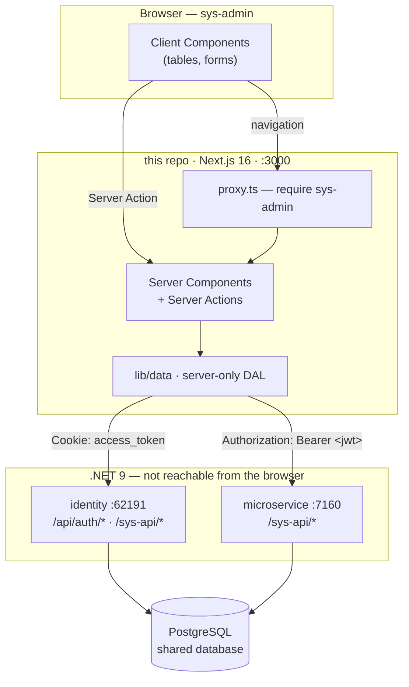

# Employee Management System Tool

System-level data management for the Employee Management platform, and the
**backend-for-frontend (BFF)** that serves it.

One audience: users holding the **`sys-admin`** role. They use this app to manage system-wide data
across every tenant — tenants, organizations, departments, managers, employees, and identity users.
Nobody below `sys-admin` has access, so there is no other permission tier to design for.

This is not the tenant-facing app. Company admins, managers, and employees use a separate frontend.

> **Status:** this app is a fresh `create-next-app` scaffold — `app/` is still the starter page.
> Both .NET services are under active development, so the tables below are a snapshot
> (2026-07-30), not a settled contract. Check `/swagger` or the service source before depending on
> a shape. Items marked **_(planned)_** don't exist yet.

## Platform layout

Four repos side by side under `Employee-Management-Tool/`.

| Repo | Role | Dev URL |
| --- | --- | --- |
| **this repo** | Sys-admin console + BFF. The only thing a browser talks to | `http://localhost:3000` |
| [`employee-management-identity`](../employee-management-identity/) | Auth + JWT issuance/refresh; `/sys-api/*` for user admin. .NET 9, ASP.NET Core Identity | `https://localhost:62191` |
| [`employee-management-microservice`](../employee-management-microservice/) | Org-domain API; this app uses its `/sys-api/*`. .NET 9, EF Core | `https://localhost:7160`, `http://localhost:5018` |
| `employee-management-tool` | **Legacy** frontend. Useful only for its [PRD](../employee-management-tool/README.md) — don't extend it | — |

Both services share one PostgreSQL database
([schema](<../Employee Management Tool.postgres.sql>)): identity owns the `AspNet*` tables and
`RefreshToken`, the microservice owns the org-domain tables. No cross-service foreign keys.

**Two different "user" records**, and user screens here usually need both:

- **`ApplicationUser`** (identity, `AspNetUsers`) — login credentials and role. Its `Id` is the
  canonical platform user id.
- **`DomainUser`** (microservice) — the org person: name, tenant, department, employment. Linked by
  `DomainUser.IdentityUserId → AspNetUsers.Id` (plain `uuid`, no FK).

## Architecture



The browser only ever talks to `:3000`. That isn't a preference — the identity service registers no
CORS at all ([`Program.cs`](../employee-management-identity/employee.management.identity/Program.cs)
never calls `AddCors`, despite the `CorsOriginSettings` key in `appsettings.json`), so cross-origin
browser calls fail preflight. Server-side calls are unaffected.

## Auth

Identity hands out tokens as **cookies**; the microservice reads an **`Authorization: Bearer`
header**. The BFF is what translates between them — reading an `HttpOnly` cookie and re-attaching it
as a header is only possible server-side.

```mermaid
sequenceDiagram
    autonumber
    participant B as Browser
    participant N as BFF (:3000)
    participant I as identity
    participant M as microservice

    B->>N: submit credentials (Server Action)
    N->>I: POST /api/auth/login
    I-->>N: 200 { User } + Set-Cookie:<br/>access_token (30 min), refresh_token (7 d)
    N->>N: check role == sys-admin, then re-issue<br/>as first-party HttpOnly cookies on :3000
    N-->>B: Set-Cookie + redirect

    B->>N: GET /tenants
    N->>N: DAL reads access_token cookie
    N->>M: GET /sys-api/get-all-tenants<br/>Authorization: Bearer &lt;jwt&gt;
    M-->>N: 200 JSON
    N-->>B: rendered HTML (no tokens)
```

Notes that will otherwise cost you time:

- **`POST /api/auth/login` returns `{ User }` only — the tokens are in `Set-Cookie`, not the body.**
- Identity's cookies are scoped to its own origin, so the BFF logs in server-side and re-issues its
  own first-party cookies **_(planned)_**.
- Access token 30 min, refresh token 7 days. On a 401, `POST /api/auth/refresh` with the
  `refresh_token` cookie rotates both. Refresh tokens are single-use, so run refresh through one
  path in the DAL rather than per-request.
- Gate on `role == "sys-admin"` in `proxy.ts`, and check again in Server Actions — those are
  independently reachable POST endpoints that `proxy.ts` never sees.

### Token claims

| Claim | Value |
| --- | --- |
| `role` | One kebab-case slug; single-valued. Must be `sys-admin` |
| `nameid` | `ApplicationUser.Id` (GUID) — the id to use |
| `sub` | `UserName`, **not** the user id |
| `exp` | 30 minutes |

No `tenant` claim, which suits this app — it works across tenants, so tenant ids are always explicit
call arguments. The signing key is symmetric and shared by both .NET services; this repo must never
hold `Jwt:Key`, it only forwards tokens.

## The system API surface

Snapshot, 2026-07-30. Route naming is verb-in-path, not REST-by-method — mirror the names in the DAL
so calls stay greppable across repos.

**Microservice `/sys-api/*`** (policy `SystemAdmin`) — the bulk of this app:

| Resource | Routes |
| --- | --- |
| Tenants | `get-all-tenants`, `get-tenant-info/{id}`, `create-tenant`, `edit-tenant/{id}`, `delete-tenant/{id}` *(cascades through orgs, departments, employees, managers)* |
| Organizations | `get-all-organizations`, `get-organization-info/{id}`, `create-organization`, `edit-organization/{id}`, `delete-organization/{id}` |
| Departments | `get-all-departments`, `get-department-info/{id:guid}`, `create-department`, `edit-department/{id:guid}`, `delete-department/{id:guid}` |
| Managers | `get-all-managers`, `add-manager`, `edit-manager/{id:guid}`, `delete-manager/{id:guid}`, `add-report-to-manager` |
| Employees | `get-all-employees`, `add-employee` |

**Identity `/sys-api/*`** (policy `SysAdmin`) — user administration:

`get-all-users`, `delete-user/{id}`, `permissions/edit-role` (how a new tenant gets its first
`company-admin`).

**Identity `/api/auth/*`** — `login`, `refresh`, `register`, `logout`, `user/{id}`, `identity/{id}`.

`/org/*` and `/report-line-api/*` on the microservice belong to the tenant-facing app. A `sys-admin`
token is accepted there, but don't call them from here.

## Configuration

Server-only. Nothing downstream may be `NEXT_PUBLIC_*` — that prefix inlines the value into the
client bundle. Keep `process.env` reads inside `lib/data/`.

```bash
# .env.local  (git-ignored)
IDENTITY_API_URL=https://localhost:62191
BUSINESS_API_URL=https://localhost:7160
SESSION_COOKIE_SECRET=            # signs this app's own session cookie
NODE_TLS_REJECT_UNAUTHORIZED=0    # dev only — .NET dev certs are self-signed
```

Both .NET services need matching `Jwt:Key` / `Jwt:Issuer` / `Jwt:Audience` plus
`ConnectionStrings:DefaultConnection`, from user secrets or environment. A mismatched issuer or
audience shows up as a blanket 401 on a token that looks perfectly valid.

## Running locally

Bottom-up; this app has no offline fallback.

```bash
# 1. PostgreSQL, then identity migrations + service
cd ../employee-management-identity
dotnet ef database update \
  --project employee.management.identity.infrastructure \
  --startup-project employee.management.identity
dotnet run --project employee.management.identity      # :62191

# 2. Business API
cd ../employee-management-microservice
dotnet run --project Employee.Management.Api           # :7160 / :5018

# 3. This app
cd ../employee-management-system-tool
npm install && npm run dev                             # :3000
```

You need a `sys-admin` user to get past login. Registration assigns `default-user`, and
`permissions/edit-role` itself requires a sys-admin — so seed the **first** one directly in the
database. Swagger is at `/swagger` on both services in Development.

Scripts: `npm run dev`, `build`, `start`, `lint`.

## Planned project structure

`app/` is routing only; shared code lives outside it. `@/*` maps to the repo root. One audience, so
routes are grouped by resource rather than by role.

```
├── app/
│   ├── login/page.tsx            # the only unauthenticated route
│   └── (console)/                # route group — no URL segment
│       ├── layout.tsx            # nav + sign-out shell
│       ├── tenants/
│       │   ├── page.tsx  loading.tsx  error.tsx
│       │   ├── actions.ts        # "use server" — re-checks role
│       │   ├── _components/      # underscore = never routable
│       │   └── [tenantId]/page.tsx
│       ├── organizations/  departments/  managers/  employees/
│       └── users/                # identity-side: roles, deletion
├── lib/
│   ├── data/                     # DAL; every file starts: import 'server-only'
│   │   ├── identity/             #   → identity /sys-api/* and /api/auth/*
│   │   └── system/               #   → microservice /sys-api/*
│   ├── api-client.ts             # base URL, bearer, refresh-on-401
│   ├── auth/session.ts           # cookies + requireSysAdmin()
│   └── validation/               # schemas; infer TS types from these
├── components/ui/                # tables, forms, confirm dialogs
├── proxy.ts                      # NOT middleware.ts (renamed in Next 16)
└── public/
```

The DAL is split by service because user screens join both. Don't add `app/api/` routes by reflex —
Server Components read and Server Actions mutate without an HTTP hop; Route Handlers are for real
HTTP consumers only.

## Backend still in progress

Unfinished work downstream, not a defect list — but worth knowing before building on it:

- **Employees have no system-tier edit or delete** — just `get-all-employees` and `add-employee`.
- **`add-report-to-manager` can create reporting cycles.** Self-reporting and cycle checks are
  deliberately deferred; validate before submitting and depth-limit org-chart rendering.
- **`/api/auth/logout` doesn't clear the cookies it set** — clear them here.
- **`/api/auth/identity/{id}` returns `null`** (its `[IdentityFilter]` is commented out). Use
  `/api/auth/user/{id}`.
- **Sibling READMEs lag their code.** Identity's shows roles as `SysAdmin`/`Admin` where
  `RoleConstants` has `sys-admin`/`company-admin`. Read the source when they disagree.
